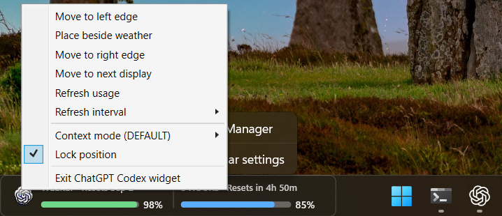
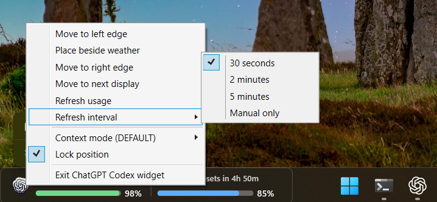
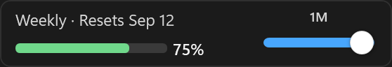
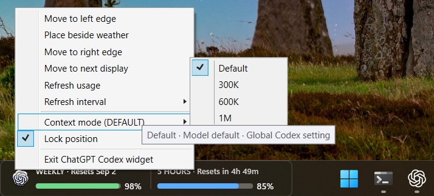

# ChatGPT Codex Usage Widget for Windows

<p align="center">
  <strong>A compact, local-first Windows taskbar companion for checking Codex usage and choosing a context mode without opening a dashboard.</strong>
</p>

<p align="center">
  <a href="https://github.com/anekhirun/CodexUsageWidget/releases/latest">Download the latest Windows x64 release</a>
  &nbsp;·&nbsp;
  <a href="CHANGELOG.md">View the changelog</a>
</p>

<p align="center">
  
  
  
  
</p>


## Start in under a minute

1. Download and extract the latest Windows x64 ZIP from [Releases](https://github.com/anekhirun/CodexUsageWidget/releases/latest).
2. Double-click **CodexTaskbarWidget.exe**.
3. Right-click the widget to refresh usage, choose a refresh interval or context mode, move it, lock it, or exit.

No administrator access, API key, browser cookie, or .NET installation is required.



## What the widget shows

| Signal | What it means |
| --- | --- |
| Weekly remaining | Remaining quota from the current long-window Codex rate limit. |
| Reset date | The next reset date when Codex provides it. |
| 5-hour remaining | Displayed beside Weekly when Codex supplies a short-window limit; otherwise it shows unavailable. |
| Freshness | The tooltip separates the latest Codex data time from the time the widget last checked it. |
| Status icon | The leftmost ChatGPT icon pulses when Codex writes a newer usage event. |
| Status color | Green, blue, amber, red, or gray indicates healthy, lower, critical, or stale data. |

The widget reads local Codex session events. It does not call a usage API or send your usage data anywhere.

## Refresh and data freshness

Use the right-click menu to choose the refresh behavior that fits your workflow.



| Setting | Behavior |
| --- | --- |
| 30 seconds | Checks local usage every 30 seconds. |
| 2 minutes / 5 minutes | Uses less background activity. |
| Manual only | Refreshes only when you choose **Refresh usage**. |

A refresh can succeed without changing the percentage: Codex may not have written newer rate-limit data yet, and the source may report whole-number percentages.

Usage reads inspect the 32 most recently modified session files. Each fast read is capped at 64 KB; when no valid event is found, only the four newest files can use a 2 MB fallback. Incomplete and invalid records are skipped. The newest valid event inside these bounds is selected. Events outside those limits may be missed; the tooltip shows the source timestamp and whether data may be stale. No per-file snapshot cache or recursive file watcher is kept.

The widget owns its position independently of Codex. It stays on the selected display, stores a monitor-relative offset, and checks taskbar geometry every second. If a display is disconnected, it uses the primary display temporarily. A hidden taskbar does not hide the widget. The window remains top-level and is never parented to Explorer.

## Compact layout

The default layout retains the weekly and 5-hour overview introduced in 2.1.2. Right-click and enable **Compact layout (context slider)** for the 279-DIP weekly indicator and four-position context slider. The choice is saved. Drag the usage area to move the widget; interacting with the slider does not drag the window. **Lock position** prevents dragging, and **Move to next display** explicitly selects another monitor.



The slider previews its selected label while dragging and saves after release. At 1M the blue fill reaches the full track width. Both the slider and the context menu use the same configuration update path.

## Codex context modes

Choose a context mode from the widget's right-click menu. The selected profile applies to new Codex tasks; existing tasks keep the configuration snapshot with which they started.



| Mode | Context window | Auto-compaction | Best for |
| --- | ---: | ---: | --- |
| Default | Model default | Standard behavior | Removing custom context overrides. |
| Balanced | 300,000 | 240,000 | Everyday coding tasks. |
| Large Codebase | 600,000 | 500,000 | More repository and tool history. |
| Long-Running Investigation | 1,000,000 | 900,000 | Investigations, migrations, and deep debugging. |

### Configuration safety

- Selecting a mode preserves your selected Codex model.
- It changes only **model_context_window** and **model_auto_compact_token_limit**.
- **Default** removes only those two overrides and leaves unrelated settings untouched.
- A non-preset pair is shown as **CUSTOM** in the context menu and stays unchanged until you deliberately select a preset.
- Existing configuration files are backed up beside the original before replacement.

<details>
<summary>Advanced: custom model catalogs</summary>

If your Codex configuration uses a custom model catalog, selecting a non-default preset sets `max_context_window` to 1,050,000 for present GPT-5.6 Sol, Terra, and Luna entries and creates a one-time backup. It preserves the current `context_window`, even when an older backup has a different value. The backup is for manual recovery and is never automatically restored over current edits. The first ceiling change can require one Codex restart; later selections only update the two TOML overrides.

</details>

### Optional Claude Code Router synchronization

If a local Claude Code Router installation is present, a deliberate preset selection also attempts to synchronize its supported model metadata. When its management service is offline before any writes, Codex can still save the preset; the tooltip explains that CCR was not synchronized. Start CCR and select the preset again to synchronize it. Invalid CCR data or failures after a write retain the failure/rollback behavior. Opening the widget only reads the current preset and never automatically rewrites either configuration.

## Start automatically with Windows

Double-click **Install Automatic Startup.vbs** to create a shortcut for the current Windows account. The widget starts about 15 seconds after sign-in so Windows Explorer and the taskbar have time to initialize.

Alternatively, run **Install Taskbar Startup.ps1** to create the current-user delayed startup entry. Run **Uninstall Taskbar Startup.ps1** to remove both current and legacy startup entries.

## Start and stop with Codex instead

From a freshly generated release package, run **Install Codex Watchdog.ps1**. This opt-in installer registers a current-user Scheduled Task triggered by the packaged Codex app event, copies the runtime into `%LOCALAPPDATA%\CodexUsageWidget\watchdog`, and removes known older widget sign-in entries. It requires a widget built from this version; it rejects the older EXE tracked at the repository root.

The watchdog starts one widget for the main Codex desktop process and requests `WM_CLOSE` when that process exits. It only adopts a running widget from the configured executable path. It never positions, resizes, reparents, or changes the z-order of a window. The widget owns all placement. Diagnostics are stored in `%APPDATA%\CodexUsageWidget\watchdog.log`.

After closing Codex and the widget, run **Uninstall Codex Watchdog.ps1** to remove this opt-in task and its copied runtime. Preferences remain in place. See [Windows validation](docs/windows-validation.md) for the required clean-profile lifecycle checks.

## Privacy and local files

The widget reads usage events only from:

    %USERPROFILE%\.codex\sessions

Its position, animation, and refresh preferences are stored in:

    %APPDATA%\CodexUsageWidget\widget-state.json

The context-mode menu writes only its documented overrides to:

    %USERPROFILE%\.codex\config.toml

Diagnostic logs live beside the widget state. They do not include conversation text, API keys, cookies, or credentials.

## Troubleshooting

| Situation | What to check |
| --- | --- |
| The widget shows --% | Start or use Codex so a local session event exists, then choose **Refresh usage**. |
| The percentage does not change | Check the tooltip: the widget may have refreshed successfully while Codex has no newer rate-limit event. |
| The 5-hour value is -- | Codex did not include a short-window rate limit in that event. |
| Context mode shows CUSTOM | Your existing context values do not exactly match a preset. Nothing is written until you select a preset. |
| A mode change is not visible in an open task | Start a new Codex task; existing tasks keep their original configuration snapshot. |
| The taskbar restarted or changed geometry | The widget recalculates its visible position automatically. |
| CCR is offline | The Codex preset still saves; start CCR and select the preset again to synchronize it. |

## Build from source

Use Windows x64 and the .NET SDK pinned in `global.json`. The application targets .NET 8 and the generated package is self-contained.

```powershell
dotnet restore tests\CodexUsageWidget.Tests\CodexUsageWidget.Tests.csproj --locked-mode
dotnet test tests\CodexUsageWidget.Tests\CodexUsageWidget.Tests.csproj -c Release --no-restore
powershell -NoProfile -File scripts\Test-Watchdog.ps1
pwsh -NoProfile -File scripts\Build-Release.ps1
```

Packaging requires a clean source checkout. The ZIP under `artifacts/release` includes the executable, startup scripts, and `build-provenance.json` with the source commit, exact SDK, product version, and executable SHA-256. A ZIP checksum is written beside it. The informational version also includes the source commit. CI runs the same commands and uploads test reports, WPF renders, and the package on PRs and pushes to `main`.

The EXE tracked at the repository root belongs to the previous release and is not updated by this PR. Test this change using the generated package. Release maintainers must build again from the final merged commit rather than publish an earlier PR artifact. See [Windows validation](docs/windows-validation.md) for evidence and manual release checks.

## Project layout

| Path | Purpose |
| --- | --- |
| src/CodexUsageWidget | Native C# / .NET 8 WPF application. |
| tests/CodexUsageWidget.Tests | Regression coverage for configuration and local usage parsing. |
| screenshots/v2.1.2 | Current screenshots used in this README. |
| CHANGELOG.md | Version-by-version release notes. |

## Contributing

Bug reports and pull requests are welcome. For UI or behavior changes, include the Windows version, the widget version, clear reproduction steps, and a screenshot when possible.
