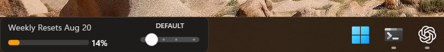
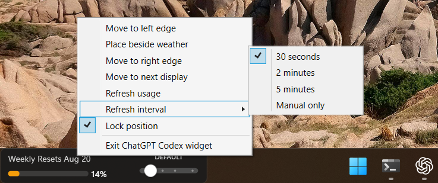
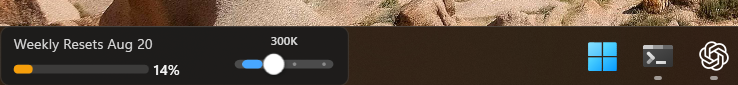
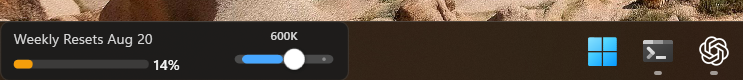
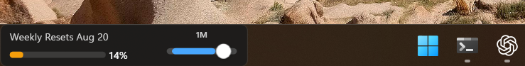

# ChatGPT Codex Usage Widget for Windows

  <strong>A compact, local-first Windows taskbar companion for checking Codex usage and choosing a context mode without opening a dashboard.</strong>

  <a href="https://github.com/anekhirun/CodexUsageWidget/releases/latest">Download the latest Windows x64 release</a>
  &nbsp;·&nbsp;
  <a href="CHANGELOG.md">View the changelog</a>

  
  
  
  

## Start in under a minute

1. Download and extract the latest Windows x64 ZIP from [Releases](https://github.com/anekhirun/CodexUsageWidget/releases/latest).
2. Double-click **CodexTaskbarWidget.exe**.
3. Right-click the widget to refresh usage, choose a refresh interval, move it, lock it, or exit.

No administrator access, API key, browser cookie, or .NET installation is required.

## What the widget shows

| Signal | What it means |
| --- | --- |
| Weekly remaining | Remaining quota from the current long-window Codex rate limit. |
| Reset date | The next reset date when Codex provides it. |
| 5-hour remaining | Available in the tooltip when Codex supplies a short-window limit. |
| Freshness | The tooltip separates the latest Codex data time from the time the widget last checked it. |
| Status color | Green, amber, red, or gray indicates healthy, lower, critical, or stale data. |

The widget reads local Codex session events. It does not call a usage API or send your usage data anywhere.

## Refresh and data freshness

Use the right-click menu to choose the refresh behavior that fits your workflow.

| Setting | Behavior |
| --- | --- |
| 30 seconds | Checks usage frequently and reacts to local session-file changes. |
| 2 minutes / 5 minutes | Uses less background activity. |
| Manual only | Refreshes only when you choose **Refresh usage**. |

A refresh can succeed without changing the percentage: Codex may not have written newer rate-limit data yet, and the source may report whole-number percentages.

## Codex context modes

The four-position slider applies a global context profile to new Codex tasks. Existing tasks keep the configuration snapshot with which they started.

<table>
  <tr>
    <td align="center"><strong>Default</strong> </td>
    <td align="center"><strong>Balanced · 300K</strong> </td>
  </tr>
  <tr>
    <td align="center"><strong>Large Codebase · 600K</strong> </td>
    <td align="center"><strong>Long-Running Investigation · 1M</strong> </td>
  </tr>
</table>

| Mode | Context window | Auto-compaction | Best for |
| --- | ---: | ---: | --- |
| Default | Model default | Standard behavior | Removing custom context overrides. |
| Balanced | 300,000 | 240,000 | Everyday coding tasks. |
| Large Codebase | 600,000 | 500,000 | More repository and tool history. |
| Long-Running Investigation | 1,000,000 | 900,000 | Investigations, migrations, and deep debugging. |

### Configuration safety

- The slider preserves your selected Codex model.
- It changes only **model_context_window** and **model_auto_compact_token_limit**.
- **Default** removes only those two overrides and leaves unrelated settings untouched.
- A non-preset pair is shown as **CUSTOM** and stays unchanged until you deliberately move the slider.
- Existing configuration files are backed up beside the original before replacement.

Advanced: custom model catalogs

If your Codex configuration uses a custom model catalog, the widget maintains a 1M maximum context ceiling for gpt-5.6-sol and creates a one-time backup of that catalog. This allows later slider changes to apply to new tasks without repeatedly expanding the catalog. The first expansion of an older catalog can require one Codex restart.

## Start and stop with Codex

Run **Install Codex Watchdog.ps1** once from an extracted release or repository checkout:

    powershell -NoProfile -ExecutionPolicy Bypass -File ".\Install Codex Watchdog.ps1"

The installer registers a current-user Scheduled Task triggered by the packaged Codex desktop app event. It does not add anything to Windows sign-in, the Startup folder, or the `HKCU\...\Run` key.

The external watchdog:

- identifies the main Codex desktop process (the packaged executable is currently named `ChatGPT.exe`);
- starts the repository's original `CodexTaskbarWidget.exe` without arguments or widget-code changes;
- tracks the largest visible Codex window and moves a top-level widget to the corresponding monitor taskbar while preserving its horizontal offset;
- waits for that exact Codex process to exit;
- detaches the widget HWND from Explorer, asks it to close normally with `WM_CLOSE`, and waits for it to exit;
- if the widget UI is blocked, terminates only the detached widget process; it never terminates a window while it is still parented to the taskbar.

Diagnostics are written to `%APPDATA%\CodexUsageWidget\watchdog.log`. After closing Codex and the widget, run **Uninstall Codex Watchdog.ps1** to remove the task and its copied runtime files without changing the widget executable or preferences. If an older release already installed Windows startup entries, run **Remove Legacy Windows Startup.ps1** once.

## Privacy and local files

The widget reads usage events only from:

    %USERPROFILE%\.codex\sessions

Its position, animation, and refresh preferences are stored in:

    %APPDATA%\CodexUsageWidget\widget-state.json

The context slider writes only its documented overrides to:

    %USERPROFILE%\.codex\config.toml

Diagnostic logs live beside the widget state. They do not include conversation text, API keys, cookies, or credentials.

## Troubleshooting

| Situation | What to check |
| --- | --- |
| The widget shows --% | Start or use Codex so a local session event exists, then choose **Refresh usage**. |
| The percentage does not change | Check the tooltip: the widget may have refreshed successfully while Codex has no newer rate-limit event. |
| The 5-hour value is -- | Codex did not include a short-window rate limit in that event. |
| The slider shows CUSTOM | Your existing context values do not exactly match a preset. Nothing is written until you move the slider. |
| A mode change is not visible in an open task | Start a new Codex task; existing tasks keep their original configuration snapshot. |
| The taskbar restarted | The widget attempts to reattach automatically. If needed, restart the widget. |
| The widget does not open with Codex | Confirm the **Codex Usage Widget Watchdog** task is enabled and inspect `%APPDATA%\CodexUsageWidget\watchdog.log`. |
| The widget remains after Codex closes | Check the log: the watchdog leaves it running only if it cannot first verify that the HWND is detached from the taskbar. |

## Build from source

Requirements:

- Windows 10/11 x64
- .NET 8 SDK

    dotnet restore src\CodexUsageWidget\CodexUsageWidget.csproj --configfile NuGet.Config
    dotnet test tests\CodexUsageWidget.Tests\CodexUsageWidget.Tests.csproj -c Release
    dotnet publish src\CodexUsageWidget\CodexUsageWidget.csproj -c Release -o publish\single

The self-contained executable is written to:

    publish\single\CodexTaskbarWidget.exe

## Project layout

| Path | Purpose |
| --- | --- |
| src/CodexUsageWidget | Native C# / .NET 8 WPF application. |
| tests/CodexUsageWidget.Tests | Regression coverage for configuration and local usage parsing. |
| scripts/watch-codex.ps1 | External lifecycle, monitor-follow, and clean-close watchdog. |
| screenshots/v2.1.1 | Current screenshots used in this README. |
| CHANGELOG.md | Version-by-version release notes. |

## Contributing

Bug reports and pull requests are welcome. For UI or behavior changes, include the Windows version, the widget version, clear reproduction steps, and a screenshot when possible.
